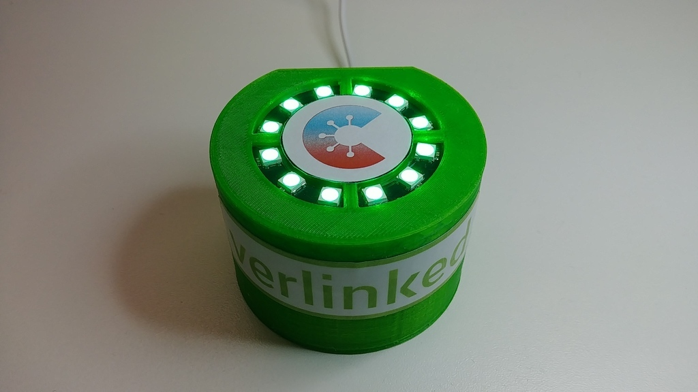
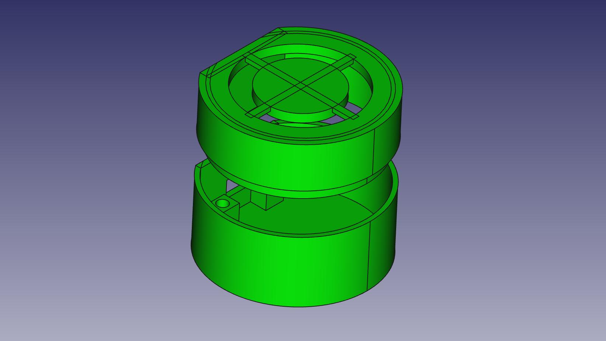
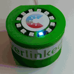

# The verlinked Green Tower

This is a smart COVID-19 app scanner device which checks for a nearby
smartphone having the Corona-Warn-App installed.

## Hardware

The project uses a ESP32 and a Neo Pixel LED circle.

## Source Code

The sources are formatted for the Arduino IDE in `green_tower_esp32`.

## Case

The case was printed with an "Ender 3" 3D printer. As construction software
the open source tool FreeCAD was used. The corresponding files are in `CAD`.

[Making of the 'Green Tower'](makingof).

## In Action

This shows the scanning in a simplified version.

