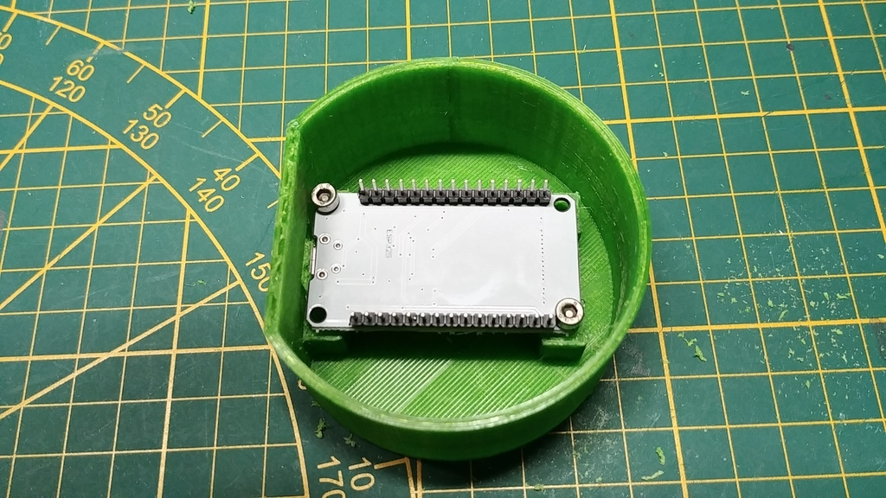

## Making of: The 'Green Tower'

On this page, we are showing the complete process of making the 'Green Tower' COVID-19 App Scanner device as an example.

|:-:|:-:|
|  | Printing the shell for the device. The 3D printer is printing the bottom part of the 'Green Tower'. |
| Put threaded inserts into the openings. This allows the screws to be loosened and tightened as often as required. |  |
|  | This is the ESP32. The Covid-19 App Scanner is installed. |
| Screw the ESP32 into the case. The screws fit perfectly into the printed openings. |  |
|  | Feed the power cable through the opening provided and connect it to the ESP32. |
| That's all for the bottom part of the 'Green Tower'. Next prepare the LED-Strip for the top part of the case. |  |
|  | Solder a short cable to the LED-strip. |
| This is the top of the 'Green Tower' containing an opening for the LED-strip. |  |
|  | The LED-Strip fits perfectly into the 3D printed top. |
| Use duct tape to keep the LED-strip in place. |  |
|  | Plug the LED-Strip into the ESP32 and shut the case. |
| Finally connected: Top and bottom parts of the tower. |  |
|  | We customized the 'Green Tower' with the Logo of our company as well as the official logo of the Corona-Warn-App. |
| The COVID-19 App Scanner in action: All lights green: Corona-Warn-App on a device nearby found. |  |
|  | All lights red: No Corona-Warn-App found. |
