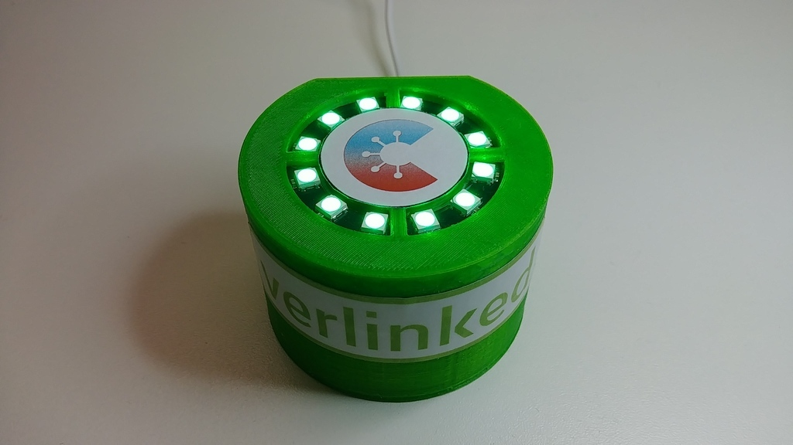

# The Idea

Imagine a device that helps to identify people having the Corona-Warn-App
installed on their smartphones. This could be useful in various scenarios.

For example, a party location where only people get access having the app on
their phones. Or giving people a free drink when they have the app
active and running. Or implement a counter to detect more than one smartphone
at a time.

# Example

The first example of a COVID-19 App Scanner device is the
[Green Tower](examples/green_tower) made by
[verlinked](https://www.verlinked.com).

# We want you

The components needed to build a Covid-19 App Scanner are a BLE hardware, such as an ESP32 chip, some LEDs or a display and your creativity. 

We are sure, there are plenty of possibilities to build a custom case made from wood, plastic, recycled materials et cetera. 

**Show us your custom made Covid-19 App Scanner device.** 

Take some pictures of your individual App-Scanner - and maybe some of the making of - 
and show them by [creating a pull request](https://github.com/verlinked/covid19-app-scanner/pulls) or [opening an issue](https://github.com/verlinked/covid19-app-scanner/issues).

We'll add your custom made Covid-19 App Scanner to our example gallery.   
 

# The Project

Visit the GitHub [project page](https://github.com/verlinked/covid19-app-scanner) to learn more.

# About

This project was initiated by the [verlinked GmbH](https://www.verlinked.com) -
a software company located in Paderborn, Germany.
